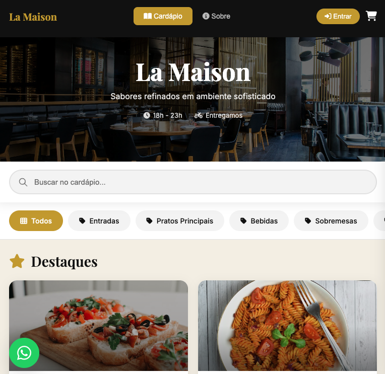
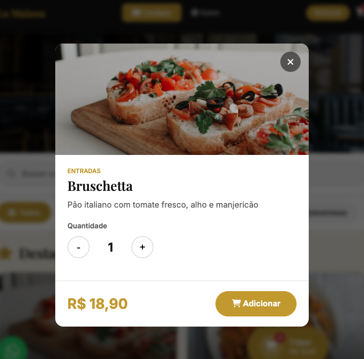
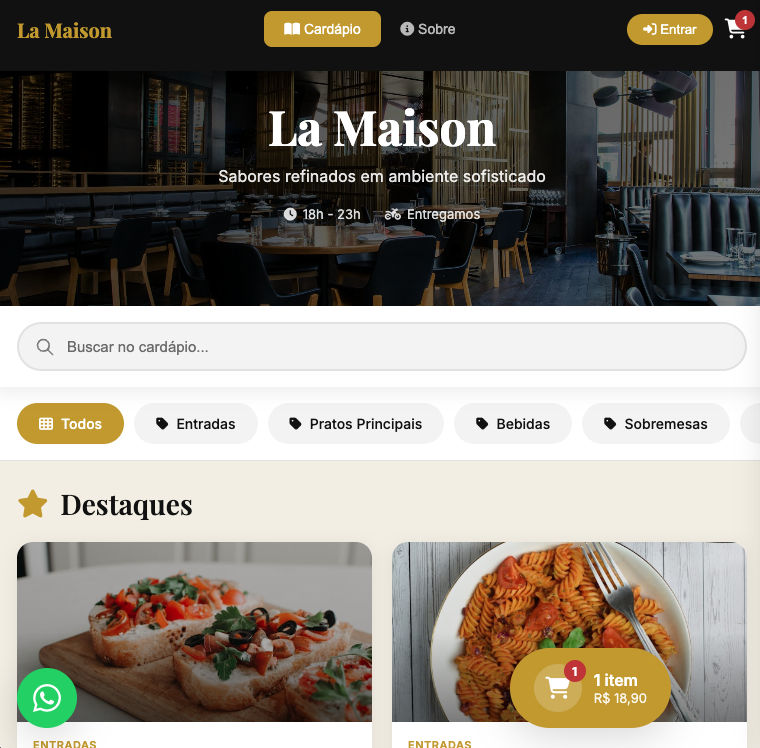
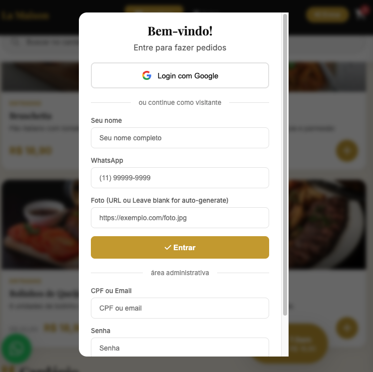

# Cardápio Digital - Restaurant Management System

<p align="center">
  
</p>

> Sistema completo de gerenciamento de restaurante com cardápio digital, delivery e painel administrativo. Interface moderna inspirada em apps como iFood e Uber Eats.

## ✨ Features

### Cliente
- 🛒 **Cardápio Digital** - Navegação por categorias com busca
- 🔍 **Busca de Produtos** - Encontre rapidamente o que procura
- 🖼️ **Galeria de Imagens** - Fotos atrativas dos pratos
- 🛵 **Sistema de Delivery** - Checkout com endereço de entrega
- 👤 **Login Social** - Autenticação com Google (OAuth 2.0)
- 📱 **Design Responsivo** - Perfeito em qualquer dispositivo
- 💬 **WhatsApp Integration** - Contato direto com clientes

### Administrador
- 📊 **Painel de Gestão** - Dashboard completo
- 🍽️ **CRUD de Produtos** - Cadastre, edite e remova pratos
- 🏷️ **CRUD de Categorias** - Organize seu cardápio
- 🪑 **CRUD de Mesas** - Gestão de mesas do restaurante
- ⚙️ **Configurações** - personalize o restaurante
- 🌐 **Redes Sociais** - Instagram e Facebook

## 🛠️ Tecnologias

### Backend
- **Java 17** com Spring Boot 3.5.3
- **H2 Database** (in-memory)
- **REST API** com Spring MVC
- **JPA/Hibernate** para persistência

### Frontend
- **Vue.js 3** (CDN)
- **Vanilla JavaScript** (sem build)
- **Font Awesome** para ícones
- **Google Fonts** (Playfair Display + Inter)
- **Axios** para requisições HTTP

## 🚀 Como Executar

### Pré-requisitos
- Java 17+
- Maven 3.8+

## ⚙️ Configurações

### Google OAuth (Opcional)
Para habilitar login automático com Google:

1. Acesse [Google Cloud Console](https://console.cloud.google.com/)
2. Crie um projeto e configure OAuth 2.0
3. Adicione `http://localhost:8080` em Origins autorizados
4. Copie o Client ID e substitua no `index.html`:
```javascript
const GOOGLE_CLIENT_ID = 'seu-client-id.apps.googleusercontent.com';
```

### Banco de Dados
O projeto usa H2 em memória por padrão. Para produção, configure PostgreSQL ou MySQL em `application.properties`.

## 🎨 Screenshots

### Cardápio Digital
- Hero com imagem de destaque
- Busca de produtos
- Filtro por categorias
- Grid de produtos com preços

### Carrinho
- Seleção de quantidade
- Formulário de entrega
- Cálculo de taxa de entrega

### Painel Admin
- Abas: Produtos, Categorias, Mesas, Sobre Nós
- Tabelas com ações de editar/excluir
- Formulários de cadastro

## 📸 Screenshots

### Cardápio Digital


### Produto Detalhado


### Carrinho de Compras


### Painel Admin


## 📄 Licença

@edudrolhe 

---

<p align="center">
  Desenvolvido com ❤️ para restaurantes modernos
</p>
